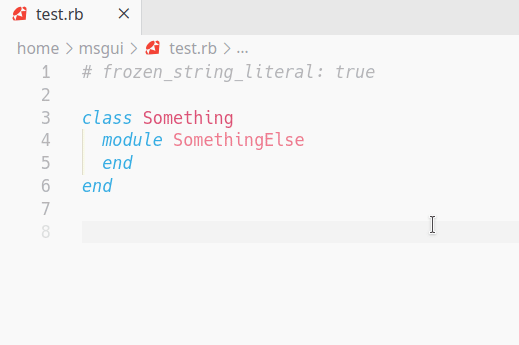

# VSCode Ruby Namespace Copy to Clipboard

This is a simple extension to help you avoid copying name from classes and modules one by one when using namespaces in Ruby.

# Usage

This extension uses [node-copy-paste](https://github.com/xavi-/node-copy-paste) therefore you should have *pbcopy/pbpaste* (for OSX), *xclip* (for Linux, FreeBSD, and OpenBSD), or *clip* (for Windows) installed in your OS.

## Demo

